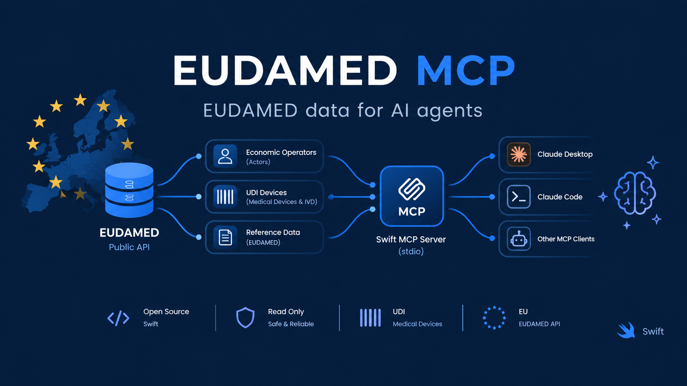

<p align="center">
  
</p>

# eudamed-mcp

A Model Context Protocol (MCP) server that exposes the [EUDAMED public API](https://github.com/tkausch/eudamed-public)
— the EU's medical device and in vitro diagnostic device registration
database — to MCP clients (Claude Desktop, Claude Code, claude.ai, etc.) — locally over
stdio, or as a remote server over Streamable HTTP.

It wraps [`eudamed-public`](https://github.com/tkausch/eudamed-public)'s
`EudamedClient` library, which already handles pagination, retries, and
resolving numeric ids to human-readable reference labels.

## Tools

| Tool | Description |
|---|---|
| `search_actors` | Search economic operators (manufacturers, authorised representatives, importers, competent authorities) by name, type, or country. |
| `get_actor` | Look up a single actor by its exact EUDAMED actor id (UUID). |
| `search_udi_devices` | Search UDI device records by identifiers, names, manufacturer, risk class, or legislation. |
| `get_udi_device` | Look up a single UDI device record by its exact Primary DI. |
| `search_reference_data` | Search reference/nomenclature lookup tables (risk classes, legislations, statuses, ...). |
| `get_reference_value` | Resolve a single reference value by numeric id, code, and language. |

All read-only; the EUDAMED public API has no write operations and requires
no authentication.

## Build

```sh
swift build -c release
```

The binary is produced at `.build/release/eudamed-mcp`.

## Start the server

The same binary runs in two modes:

| Mode | Command | Use it for |
|---|---|---|
| stdio (default) | `eudamed-mcp` | Local clients that launch the server themselves (Claude Desktop, Claude Code) |
| HTTP | `eudamed-mcp serve` | A remote server that clients connect to by URL |

### stdio

```sh
.build/release/eudamed-mcp
```

The server speaks MCP over stdio: JSON-RPC messages in on stdin, one per
line, and responses out on stdout, one per line. All logging goes to
stderr so it never corrupts the protocol stream. You normally don't start
it by hand; the MCP client launches it (see
[Configure in an MCP client](#configure-in-an-mcp-client)).

### HTTP (remote server)

Start it locally (listens on `127.0.0.1:8080` by default):

```sh
.build/release/eudamed-mcp serve
```

or, during development, without a separate build step:

```sh
swift run eudamed-mcp serve
```

To accept connections from other machines, bind to all interfaces and
run in production mode:

```sh
EUDAMED_MCP_TOKEN=change-me \
  .build/release/eudamed-mcp serve --env production --hostname 0.0.0.0 --port 8080
```

Check that it is up:

```sh
curl http://localhost:8080/health
# ok

curl http://localhost:8080/mcp \
  -H 'Content-Type: application/json' \
  -H 'Accept: application/json, text/event-stream' \
  -H 'Authorization: Bearer change-me' \
  -d '{"jsonrpc":"2.0","id":1,"method":"tools/list"}'
```

Stop it with `Ctrl+C`.

#### Options

| Option | Default | Effect |
|---|---|---|
| `--hostname` (or `HOST`) | `127.0.0.1` | Interface to bind. Use `0.0.0.0` to accept remote connections. |
| `--port` (or `PORT`) | `8080` | Port to listen on. |
| `--env` | `development` | `production` reduces log noise. |
| `EUDAMED_MCP_TOKEN` | unset | Require `Authorization: Bearer <token>` on `/mcp`. Unset = open endpoint. |
| `EUDAMED_MCP_ALLOWED_HOSTS` | unset | Comma-separated `Host` header values to accept (e.g. `eudamed.example.com,localhost:*`), as DNS rebinding protection. Unset = not checked. |

#### Endpoints

- `POST /mcp`: the MCP endpoint (Streamable HTTP).
- `GET /health`: returns `ok`, for load balancer checks.

The server uses the MCP SDK's stateless HTTP transport. Every request is
handled independently, with plain JSON responses and no sessions, so you
can run several instances behind a load balancer without sticky routing.

CORS is enabled for all origins, so browser-based clients such as
[MCP Inspector](#test-with-mcp-inspector) can connect directly. Protect a
public deployment with `EUDAMED_MCP_TOKEN`.

The server speaks plain HTTP. Put TLS in front of it with a reverse proxy
or your hosting platform.

### Container

The image is defined in `Containerfile`. With [Apple container](https://github.com/apple/container):

```sh
container build -t eudamed-mcp .
container run -d --name eudamed-mcp -p 8080:8080 -e EUDAMED_MCP_TOKEN=change-me eudamed-mcp
```

With Docker, pass the file explicitly:

```sh
docker build -f Containerfile -t eudamed-mcp .
docker run -d --name eudamed-mcp -p 8080:8080 -e EUDAMED_MCP_TOKEN=change-me eudamed-mcp
```

#### Update the container

A running container keeps its image, so updating means rebuilding the image
and replacing the container:

```sh
# 1. Get the latest code.
git pull

# 2. Optional: move dependencies (e.g. eudamed-public) to their newest
#    allowed versions. Commit the changed Package.resolved.
swift package update

# 3. Rebuild. --pull refreshes the swift:latest and swift:slim base images,
#    picking up Swift and OS security fixes.
container build --pull -t eudamed-mcp .

# 4. Replace the running container.
container stop eudamed-mcp
container rm eudamed-mcp
container run -d --name eudamed-mcp -p 8080:8080 -e EUDAMED_MCP_TOKEN=change-me eudamed-mcp

# 5. Check it is up, then remove the old, now unused images.
curl http://127.0.0.1:8080/health
container image prune
```

With Docker, the steps are the same: `docker build --pull -f Containerfile -t eudamed-mcp .`,
then `docker stop`, `docker rm`, `docker run` as above, and `docker image prune`.

## Configure in an MCP client

### Remote (HTTP)

Claude Code:

```sh
claude mcp add --transport http eudamed https://your-host/mcp \
  --header "Authorization: Bearer change-me"
```

On claude.ai, add it as a custom connector with the same URL.

### Local (stdio)

For Claude Desktop / Claude Code, add to your MCP server config:

```json
{
  "mcpServers": {
    "eudamed": {
      "command": "/absolute/path/to/eudamed-mcp/.build/release/eudamed-mcp"
    }
  }
}
```

## Test with MCP Inspector

[MCP Inspector](https://github.com/modelcontextprotocol/inspector) is a
browser UI (and CLI) for calling the server's tools by hand. It needs
Node.js; `npx` downloads it on first use.

### Web UI

```sh
npx @modelcontextprotocol/inspector
```

This opens the Inspector at `http://localhost:6274` with a session token
already in the URL. Then connect to the server one of two ways.

**Over HTTP.** Start the server first (`swift run eudamed-mcp serve`), then
in the Inspector sidebar set:

| Field | Value |
|---|---|
| Transport Type | `Streamable HTTP` |
| URL | `http://localhost:8080/mcp` |
| Authentication | Only if `EUDAMED_MCP_TOKEN` is set: header `Authorization`, value `Bearer <token>` |

**Over stdio.** Build first (`swift build`), then set:

| Field | Value |
|---|---|
| Transport Type | `STDIO` |
| Command | `/absolute/path/to/eudamed-mcp/.build/debug/eudamed-mcp` |
| Arguments | *(empty)* |

You can also pass the server on the command line, which pre-fills these
fields:

```sh
npx @modelcontextprotocol/inspector .build/debug/eudamed-mcp
```

Click **Connect**, open the **Tools** tab, click **List Tools**, pick a tool,
fill in its arguments and click **Run Tool**.

### CLI

Add `--cli` to run a single request and print the JSON result, which is
handy for quick checks and scripts:

```sh
# List the tools (HTTP; the transport is detected from the /mcp path)
npx @modelcontextprotocol/inspector --cli http://localhost:8080/mcp \
  --method tools/list

# Call a tool (stdio)
npx @modelcontextprotocol/inspector --cli .build/debug/eudamed-mcp \
  --method tools/call --tool-name search_actors \
  --tool-arg "name=Roche Diagnostics GmbH"
```

With a token, add `--header "Authorization: Bearer <token>"`.

### Troubleshooting

- **Connection fails over HTTP:** check that the server is running
  (`curl http://localhost:8080/health`) and that the URL ends in `/mcp`.
- **401 Unauthorized:** the token is missing or wrong. It must match
  `EUDAMED_MCP_TOKEN` and be sent as `Bearer <token>`.
- **Request rejected for its Host or Origin:** if `EUDAMED_MCP_ALLOWED_HOSTS` is set, it must
  include the host you connect to, e.g. `localhost:*,127.0.0.1:*`.
- **"Method Not Allowed" on GET:** expected. The server is stateless and
  doesn't offer an SSE stream; the Inspector falls back to plain POST.

## Development

```sh
swift build
swift test
```

## License

Licensed under [PolyForm Noncommercial 1.0.0](https://polyformproject.org/licenses/noncommercial/1.0.0) —
see `LICENSE`. It depends on
[`eudamed-public`](https://github.com/tkausch/eudamed-public), which is
licensed under the same terms; see that project's `EULA.md` for commercial
licensing options.
